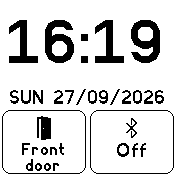

# Duo Clock

A simple clock for Bangle.js 2: a large time and date at the top, and two
large [Clock Info](https://banglejs.com/apps/?id=clock_info) slots underneath.

The slots are made big so they're easy to hit - for example, keep a
[Home Assistant](https://banglejs.com/apps/?id=ha) trigger in one and the
weather or your step count in the other.

## Usage

* Tap a slot to focus it (it gets a thicker border)
* Swipe left/right to change category (Bangle, Home, Weather...)
* Swipe up/down to change the item within that category
* Tap the focused slot again to run it (e.g. send a Home Assistant trigger)
* Tap anywhere else to unfocus

Each slot remembers what it was showing.

Install apps tagged `clkinfo` to get more things to show - see
https://banglejs.com/apps/?c=clkinfo
